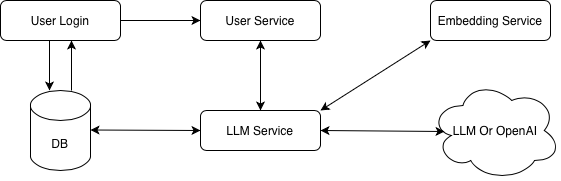
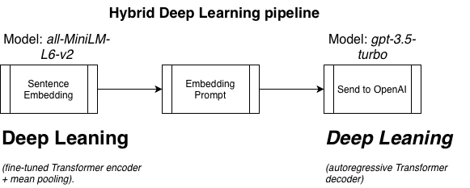

# GenAiMediaRecommendation

## High Level Diagram



## AI Technique Used



## Getting started
### 1 Build and start the services
```
docker compose up
```
Below services should up and running
```
docker compose ps

NAME                                           COMMAND                   SERVICE             STATUS              PORTS
genaimediarecommendation-embedding-service-1   "uvicorn app.main:ap…"    embedding-service   running             0.0.0.0:8002->8002/tcp
genaimediarecommendation-kafka-init-1          "bash -c '\n  # Wait …"   kafka-init          exited (127)        
genaimediarecommendation-llm-service-1         "uvicorn app.main:ap…"    llm-service         running             0.0.0.0:8001->8001/tcp
genaimediarecommendation-postgres-1            "docker-entrypoint.s…"    postgres            running (healthy)   5432/tcp
genaimediarecommendation-redis-1               "docker-entrypoint.s…"    redis               running (healthy)   6379/tcp
genaimediarecommendation-zookeeper-1           "/etc/confluent/dock…"    zookeeper           running (healthy)   2888/tcp, 0.0.0.0:2181->2181/tcp, 3888/tcp
kafka1                                         "/etc/confluent/dock…"    kafka1              running (healthy)   0.0.0.0:9092->9092/tcp, 0.0.0.0:19092->19092/tcp
```
### 2 Check POSTGRES DB
```
docker exec -it genaimediarecommendation-postgres-1 bash

root@7d7af2004038:/# psql -U user -d media_recs

media_recs-# \dt
              List of relations
 Schema |        Name        | Type  | Owner 
--------+--------------------+-------+-------
 public | content_embeddings | table | user
(1 row)

media_recs=# SELECT * FROM content_embeddings;
 content_id | embedding 
------------+-----------
(0 rows)

```


### 3 Test Embedding service APIs
#### Generate Embedding for Text
```
curl -X POST http://localhost:8002/generate_embedding -H "Content-Type: application/json" -d '{"text": "Mission Impossible."}'

{"embedding":[-0.08887554705142975,0.0027819303795695305,-0.054871898144483566,0.016817912459373474,-0.023579055443406105,-0.02386576309800148,0.03384979069232941,-0.030343888327479362,0.058463480323553085,-0.02094760723412037,0.020633727312088013,0.027327196672558784,0.02491173706948757,-0.024415751919150352,-0.0033030728809535503,-0.04643910378217697,0.030776724219322205,0.05055497586727142,0.012528831139206886,-0.006316585931926966,0.07100573927164078,0.06380347907543182,-0.012758131138980389,0.06587228924036026,-0.0498804897069931,0.12016412615776062,0.002439451403915882,-0.00459065567702055,-0.11466934531927109,-0.05891164764761925,-0.004786298610270023,0.04953518509864807,-0.009114900603890419,-0.04205941781401634,0.07279498875141144,-0.020417293533682823,0.009964898228645325,-0.004353456199169159,0.022686395794153214,-0.03153455629944801,-0.09471599757671356,-0.055844154208898544,0.06821867823600769,-0.02461325004696846,0.01844325289130211,-0.03592188283801079,-0.013940416276454926,-0.06121727451682091,0.07901581376791,0.06394010782241821,-0.05782994627952576,-0.03469737619161606,-0.06452896445989609,0.0016196717042475939,0.04000171646475792,-0.08097109943628311,-0.04610675573348999,0.02463831566274166,0.02169652469456196,-0.05179983004927635,-0.055389899760484695,0.0087848836556077,-0.017509549856185913,0.082639679312706,0.07702586054801941,0.025721553713083267,-0.008384289219975471,-0.060578059405088425,-0.0018611553823575377,0.009422588162124157,-0.0216959398239851,0.023106446489691734,-0.05548200383782387,-0.030229872092604637,0.0006867965566925704,-0.010883813723921776,0.101594477891922,0.022525284439325333,0.022976946085691452,0.020244885236024857,0.015061219222843647,-0.18329039216041565,-0.08764506876468658,0.06686419993638992,-0.022849511355161667,-0.017681201919913292,-0.007312781177461147,0.04377632960677147,0.03067767433822155,0.09740328788757324,-0.18523573875427246,-0.030380278825759888,0.02251705527305603,0.05094532668590546,-0.06277841329574585,-0.012633604928851128,-0.03992834314703941,-0.08117775619029999,-0.1022816151380539,0.11232350021600723,-0.02380327321588993,-0.011377823539078236,0.008802376687526703,-0.0439668633043766,0.04674164578318596,0.0013210902689024806,0.062381960451602936,-0.06974279880523682,0.03963365778326988,-0.04468415305018425,-0.03333612158894539,-0.023258903995156288,-0.02227971702814102,-0.033834028989076614,-0.04853793978691101,-0.0060735405422747135,0.05928437411785126,0.005723150447010994,-0.05605168640613556,0.05523135885596275,0.060873713344335556,0.022271975874900818,-0.01655062846839428,-0.009294471703469753,-0.06144127622246742,-0.04627388343214989,0.07579763978719711,-6.368850433274232e-33,-0.03075486235320568,-0.021080302074551582,0.052362147718667984,0.02013583481311798,0.03352740406990051,0.03814159333705902,-0.05066163092851639,-0.02905985526740551,-0.04069528356194496,0.07360079884529114,-0.03198988735675812,-0.03786372020840645,-0.039776142686605453,-0.0317285992205143,0.1602495014667511,0.05782146006822586,0.02016674354672432,0.018757112324237823,0.01165682077407837,-0.008340823464095592,0.0002119335113093257,0.00047817721497267485,-0.061890799552202225,-0.03065245784819126,0.0552857406437397,0.03805026784539223,-0.02025376819074154,-0.04099443182349205,0.04891141131520271,0.019296402111649513,-0.01887134276330471,0.1133560761809349,0.010080656968057156,0.036255817860364914,0.04436297342181206,-0.0312863327562809,-0.07003165781497955,-0.012922749854624271,-0.02140439674258232,0.08120758086442947,-0.07238884270191193,0.018025841563940048,-0.005837122444063425,0.003405030583962798,0.023595282807946205,0.004923050291836262,0.11458499729633331,-0.04498869925737381,0.015016531571745872,0.066829152405262,0.03648500144481659,0.02106381207704544,-0.04016890376806259,0.045206792652606964,0.006011319812387228,-0.049787264317274094,0.042729701846838,0.00852612778544426,-0.007200857624411583,0.0067787631414830685,-0.0073691061697900295,-0.0557345487177372,0.06070168316364288,0.018507180735468864,0.00919481460005045,0.034634824842214584,0.005314178764820099,0.006939077749848366,0.01188222412019968,0.03344358876347542,-0.030191441997885704,-0.0013151484308764338,0.04393421486020088,-0.07281333208084106,0.016441505402326584,-0.007727566175162792,0.04433578625321388,-0.0010091143194586039,-0.006669134367257357,-0.025601767003536224,-0.03478841111063957,-0.02350582741200924,0.06490198522806168,0.06475315988063812,0.03314068540930748,0.040385566651821136,-0.034905046224594116,0.01787513494491577,0.0072927577421069145,-0.06738999485969543,-0.05373816937208176,-0.04458921030163765,0.007878253236413002,0.008946351706981659,-0.042177289724349976,5.636889937484363e-33,-0.016713036224246025,-0.03174028918147087,0.04455139860510826,-0.0133108701556921,0.03440392017364502,-0.027008134871721268,-0.0474495030939579,0.05166786536574364,0.00572638213634491,0.03199769929051399,-0.07613661885261536,-0.019442591816186905,0.04226771369576454,-0.013869141228497028,0.03325152024626732,0.009127599187195301,0.0413052998483181,-0.007185067515820265,0.023930683732032776,0.04869512841105461,0.07466749846935272,-0.025423865765333176,-0.04317839443683624,-0.04811910167336464,0.017928151413798332,0.030702322721481323,0.05863650515675545,-0.005463024601340294,-0.014853090979158878,-0.05470075085759163,0.051045436412096024,-0.01434672437608242,0.018000569194555283,0.02856622263789177,-0.0027168788947165012,0.23235470056533813,-0.012038210406899452,0.02365300990641117,-0.04745447635650635,-0.04414390027523041,0.0085175521671772,0.03928650915622711,-0.04447169601917267,0.07620034366846085,-0.031995031982660294,0.028591226786375046,0.1017230972647667,0.07539229094982147,-0.04413045570254326,0.034961309283971786,-0.09090276062488556,0.0034252891782671213,-0.0369500108063221,-0.02368682436645031,-0.00892860721796751,0.02166564203798771,-0.050248537212610245,0.02753535285592079,0.08294149488210678,-0.031772516667842865,0.07782258838415146,0.023590950295329094,-0.04019234701991081,-0.01878182962536812,-0.07290339469909668,0.06669142097234726,-0.057581935077905655,0.11167886108160019,-0.04180736467242241,0.06783748418092728,-0.015755824744701385,0.0027164770290255547,-0.008458498865365982,0.02898739092051983,0.018374621868133545,0.027327144518494606,-0.0503486804664135,-0.01919713243842125,-0.019096991047263145,-0.05564514175057411,0.01585434377193451,-0.05358794704079628,0.001011809566989541,0.08833783864974976,0.06058356910943985,0.08903592079877853,0.021459054201841354,0.015851512551307678,-0.004985000006854534,0.023987505584955215,-0.05978439375758171,-0.03047843836247921,0.06531388312578201,0.024934327229857445,0.00013453830615617335,-1.358763590530998e-08,0.03917016461491585,-0.03515380993485451,-0.10102970898151398,-0.05594523623585701,-0.01951625570654869,-0.006560702342540026,-0.012641270644962788,0.02550433948636055,-0.004873600788414478,0.03468744829297066,-0.027018960565328598,0.021635184064507484,0.014206468127667904,0.04327341541647911,-0.061021722853183746,0.09132888168096542,0.033758360892534256,0.009825292974710464,-0.031247155740857124,-0.01603437028825283,-0.06593502312898636,0.02980811707675457,0.05835019797086716,-0.0961814820766449,0.01578618586063385,0.028880702331662178,-0.057343490421772,0.04261698201298714,0.05776335671544075,0.10805386304855347,0.0386691689491272,-0.05406298488378525,-0.09455293416976929,0.0473504476249218,-0.04239853844046593,-0.0197297390550375,0.03178780525922775,0.03435022756457329,-0.07922207564115524,-0.13817833364009857,0.053781066089868546,0.152516707777977,0.014242545701563358,0.029793350026011467,-0.04075169190764427,-0.03869383782148361,0.08800483494997025,-0.0627041608095169,0.008173331618309021,-0.05027337372303009,0.024137916043400764,0.05776815861463547,-0.05316512659192085,0.059875670820474625,0.09007878601551056,0.0634407177567482,0.011501885019242764,0.04453308880329132,-0.06718447059392929,0.04482186585664749,0.10689450800418854,-0.0503208301961422,-0.06425394117832184,-0.06393176317214966]}%
```
#### Get Candidate Content
```
curl -X POST http://localhost:8002/get_candidate_content -H "Content-Type: application/json" -d '{"query_embedding": [-0.08887554705142975,0.0027819303795695305,-0.054871898144483566,0.016817912459373474,-0.023579055443406105,-0.02386576309800148,0.03384979069232941,-0.030343888327479362,0.058463480323553085,-0.02094760723412037,0.020633727312088013,0.027327196672558784,0.02491173706948757,-0.024415751919150352,-0.0033030728809535503,-0.04643910378217697,0.030776724219322205,0.05055497586727142,0.012528831139206886,-0.006316585931926966,0.07100573927164078,0.06380347907543182,-0.012758131138980389,0.06587228924036026,-0.0498804897069931,0.12016412615776062,0.002439451403915882,-0.00459065567702055,-0.11466934531927109,-0.05891164764761925,-0.004786298610270023,0.04953518509864807,-0.009114900603890419,-0.04205941781401634,0.07279498875141144,-0.020417293533682823,0.009964898228645325,-0.004353456199169159,0.022686395794153214,-0.03153455629944801,-0.09471599757671356,-0.055844154208898544,0.06821867823600769,-0.02461325004696846,0.01844325289130211,-0.03592188283801079,-0.013940416276454926,-0.06121727451682091,0.07901581376791,0.06394010782241821,-0.05782994627952576,-0.03469737619161606,-0.06452896445989609,0.0016196717042475939,0.04000171646475792,-0.08097109943628311,-0.04610675573348999,0.02463831566274166,0.02169652469456196,-0.05179983004927635,-0.055389899760484695,0.0087848836556077,-0.017509549856185913,0.082639679312706,0.07702586054801941,0.025721553713083267,-0.008384289219975471,-0.060578059405088425,-0.0018611553823575377,0.009422588162124157,-0.0216959398239851,0.023106446489691734,-0.05548200383782387,-0.030229872092604637,0.0006867965566925704,-0.010883813723921776,0.101594477891922,0.022525284439325333,0.022976946085691452,0.020244885236024857,0.015061219222843647,-0.18329039216041565,-0.08764506876468658,0.06686419993638992,-0.022849511355161667,-0.017681201919913292,-0.007312781177461147,0.04377632960677147,0.03067767433822155,0.09740328788757324,-0.18523573875427246,-0.030380278825759888,0.02251705527305603,0.05094532668590546,-0.06277841329574585,-0.012633604928851128,-0.03992834314703941,-0.08117775619029999,-0.1022816151380539,0.11232350021600723,-0.02380327321588993,-0.011377823539078236,0.008802376687526703,-0.0439668633043766,0.04674164578318596,0.0013210902689024806,0.062381960451602936,-0.06974279880523682,0.03963365778326988,-0.04468415305018425,-0.03333612158894539,-0.023258903995156288,-0.02227971702814102,-0.033834028989076614,-0.04853793978691101,-0.0060735405422747135,0.05928437411785126,0.005723150447010994,-0.05605168640613556,0.05523135885596275,0.060873713344335556,0.022271975874900818,-0.01655062846839428,-0.009294471703469753,-0.06144127622246742,-0.04627388343214989,0.07579763978719711,-6.368850433274232e-33,-0.03075486235320568,-0.021080302074551582,0.052362147718667984,0.02013583481311798,0.03352740406990051,0.03814159333705902,-0.05066163092851639,-0.02905985526740551,-0.04069528356194496,0.07360079884529114,-0.03198988735675812,-0.03786372020840645,-0.039776142686605453,-0.0317285992205143,0.1602495014667511,0.05782146006822586,0.02016674354672432,0.018757112324237823,0.01165682077407837,-0.008340823464095592,0.0002119335113093257,0.00047817721497267485,-0.061890799552202225,-0.03065245784819126,0.0552857406437397,0.03805026784539223,-0.02025376819074154,-0.04099443182349205,0.04891141131520271,0.019296402111649513,-0.01887134276330471,0.1133560761809349,0.010080656968057156,0.036255817860364914,0.04436297342181206,-0.0312863327562809,-0.07003165781497955,-0.012922749854624271,-0.02140439674258232,0.08120758086442947,-0.07238884270191193,0.018025841563940048,-0.005837122444063425,0.003405030583962798,0.023595282807946205,0.004923050291836262,0.11458499729633331,-0.04498869925737381,0.015016531571745872,0.066829152405262,0.03648500144481659,0.02106381207704544,-0.04016890376806259,0.045206792652606964,0.006011319812387228,-0.049787264317274094,0.042729701846838,0.00852612778544426,-0.007200857624411583,0.0067787631414830685,-0.0073691061697900295,-0.0557345487177372,0.06070168316364288,0.018507180735468864,0.00919481460005045,0.034634824842214584,0.005314178764820099,0.006939077749848366,0.01188222412019968,0.03344358876347542,-0.030191441997885704,-0.0013151484308764338,0.04393421486020088,-0.07281333208084106,0.016441505402326584,-0.007727566175162792,0.04433578625321388,-0.0010091143194586039,-0.006669134367257357,-0.025601767003536224,-0.03478841111063957,-0.02350582741200924,0.06490198522806168,0.06475315988063812,0.03314068540930748,0.040385566651821136,-0.034905046224594116,0.01787513494491577,0.0072927577421069145,-0.06738999485969543,-0.05373816937208176,-0.04458921030163765,0.007878253236413002,0.008946351706981659,-0.042177289724349976,5.636889937484363e-33,-0.016713036224246025,-0.03174028918147087,0.04455139860510826,-0.0133108701556921,0.03440392017364502,-0.027008134871721268,-0.0474495030939579,0.05166786536574364,0.00572638213634491,0.03199769929051399,-0.07613661885261536,-0.019442591816186905,0.04226771369576454,-0.013869141228497028,0.03325152024626732,0.009127599187195301,0.0413052998483181,-0.007185067515820265,0.023930683732032776,0.04869512841105461,0.07466749846935272,-0.025423865765333176,-0.04317839443683624,-0.04811910167336464,0.017928151413798332,0.030702322721481323,0.05863650515675545,-0.005463024601340294,-0.014853090979158878,-0.05470075085759163,0.051045436412096024,-0.01434672437608242,0.018000569194555283,0.02856622263789177,-0.0027168788947165012,0.23235470056533813,-0.012038210406899452,0.02365300990641117,-0.04745447635650635,-0.04414390027523041,0.0085175521671772,0.03928650915622711,-0.04447169601917267,0.07620034366846085,-0.031995031982660294,0.028591226786375046,0.1017230972647667,0.07539229094982147,-0.04413045570254326,0.034961309283971786,-0.09090276062488556,0.0034252891782671213,-0.0369500108063221,-0.02368682436645031,-0.00892860721796751,0.02166564203798771,-0.050248537212610245,0.02753535285592079,0.08294149488210678,-0.031772516667842865,0.07782258838415146,0.023590950295329094,-0.04019234701991081,-0.01878182962536812,-0.07290339469909668,0.06669142097234726,-0.057581935077905655,0.11167886108160019,-0.04180736467242241,0.06783748418092728,-0.015755824744701385,0.0027164770290255547,-0.008458498865365982,0.02898739092051983,0.018374621868133545,0.027327144518494606,-0.0503486804664135,-0.01919713243842125,-0.019096991047263145,-0.05564514175057411,0.01585434377193451,-0.05358794704079628,0.001011809566989541,0.08833783864974976,0.06058356910943985,0.08903592079877853,0.021459054201841354,0.015851512551307678,-0.004985000006854534,0.023987505584955215,-0.05978439375758171,-0.03047843836247921,0.06531388312578201,0.024934327229857445,0.00013453830615617335,-1.358763590530998e-08,0.03917016461491585,-0.03515380993485451,-0.10102970898151398,-0.05594523623585701,-0.01951625570654869,-0.006560702342540026,-0.012641270644962788,0.02550433948636055,-0.004873600788414478,0.03468744829297066,-0.027018960565328598,0.021635184064507484,0.014206468127667904,0.04327341541647911,-0.061021722853183746,0.09132888168096542,0.033758360892534256,0.009825292974710464,-0.031247155740857124,-0.01603437028825283,-0.06593502312898636,0.02980811707675457,0.05835019797086716,-0.0961814820766449,0.01578618586063385,0.028880702331662178,-0.057343490421772,0.04261698201298714,0.05776335671544075,0.10805386304855347,0.0386691689491272,-0.05406298488378525,-0.09455293416976929,0.0473504476249218,-0.04239853844046593,-0.0197297390550375,0.03178780525922775,0.03435022756457329,-0.07922207564115524,-0.13817833364009857,0.053781066089868546,0.152516707777977,0.014242545701563358,0.029793350026011467,-0.04075169190764427,-0.03869383782148361,0.08800483494997025,-0.0627041608095169,0.008173331618309021,-0.05027337372303009,0.024137916043400764,0.05776815861463547,-0.05316512659192085,0.059875670820474625,0.09007878601551056,0.0634407177567482,0.011501885019242764,0.04453308880329132,-0.06718447059392929,0.04482186585664749,0.10689450800418854,-0.0503208301961422,-0.06425394117832184,-0.06393176317214966], "limit": 10}'

{"candidates":[]}%
```
(Note: This needs fixing. Database should be updated with candidates before request to get contents. `llm-service/main/py`)

### 4 Test `llm_service`

1. #### Get into kafka1 service
```
docker exec -it kafka1 bash
```

2. #### Create Recommendation request: Producer: Topic `rec.request`
```
echo "user123:{\"requestId\": \"req123\", \"userId\": \"user123\", \"programe_title\": \"Taken\", \"ts\": 1678886400}" | kafka-console-producer --topic rec.request --bootstrap-server localhost:9092 --property "parse.key=true" --property "key.separator=:"

```

3. #### `llm_service` will be Consumer and verify `rec.request`
```
kafka-console-consumer --bootstrap-server kafka1:19092 --topic=rec.request --from-beginning

{"requestId": "req123", "userId": "user123", "programe_title": "Mission Impossible", "ts": 1678886400}
```

4. #### `llm_service` will send recommendation content once recieved from LLM. Verify Response received from LLM : Topic `rec.ready`
This is recommendation recieved using OpenAi APIs
```
kafka-console-consumer --bootstrap-server kafka1:19092 --topic=rec.ready --from-beginning

{"requestId": "req123", "userId": "user123", "recs": [{"contentId": "m-789", "score": 0.98, "reason": "Sci-fi thriller"}, {"contentId": "m-234", "score": 0.85, "reason": "Sci-fi epic"}], "ts": 1678886400}
```

Note: this recommendation is expected from OpenAI APIs. It needs to be tested after buying some credit, as APIs are not free.

### 5 Verify User content recommendation on redis cache
```
docker exec -it genaimediarecommendation-redis-1 bash

root@5a6b73d8b5dd:/data# redis-cli KEYS "*"
1) "recs:user123"

root@5a6b73d8b5dd:/data# redis-cli GET recs:user123
"{\"requestId\": \"req123\", \"userId\": \"user123\", \"recs\": [{\"contentId\": \"m-789\", \"score\": 0.98, \"reason\": \"Sci-fi thriller\"}, {\"contentId\": \"m-234\", \"score\": 0.85, \"reason\": \"Sci-fi epic\"}], \"ts\": 1678886400}"

root@5a6b73d8b5dd:/data# redis-cli SCAN 0
1) "0"
2) 1) "recs:user123"

root@5a6b73d8b5dd:/data# redis-cli DEL recs:user123
(integer) 1

root@5a6b73d8b5dd:/data# redis-cli GET recs:user123
(nil)

```