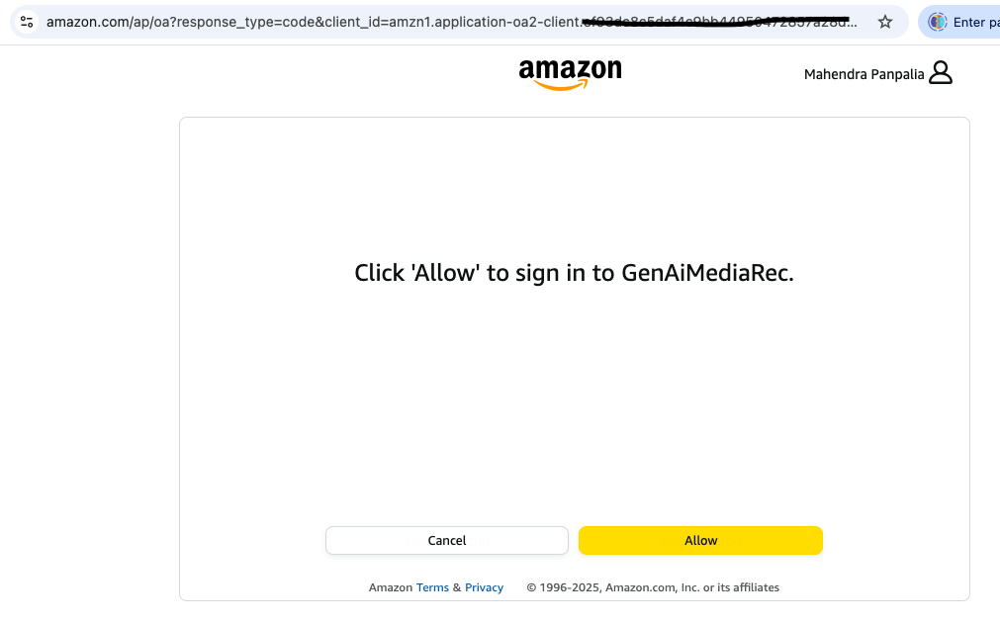
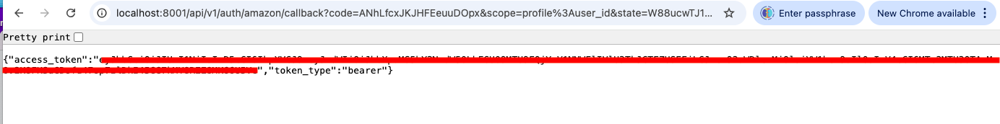
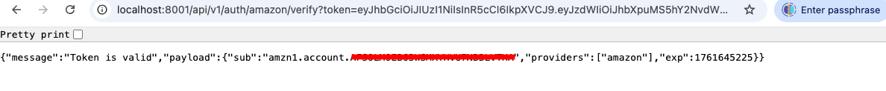

# GenAiMediaRecommendation

## Proposed Architecture Diagrame (Subject to change)
```
Web UI ──(HTTP/gRPC)──> Auth Service ──(Kafka Pub)──> user-login-topic ──(Sub)──> User Service
                                                                 │
                                                                 ▼
                                                       rec-request-topic ──(Sub)──> Rec Service ──(gRPC/Async)──> LLM Service
                                                                 │                                           │
                                                                 ▼                                           ▼
                                                       rec-response-topic <──(Pub)──                  Vector DB (Embeddings)
                                                                 │
                                                                 ▼
Web UI <──(WebSocket/Polling + gRPC Fallback)── Rec Service (Enriched Recs)
```

## Proposed Git Repo Layout (Subject to change)
```
media-recs/
├─ docker-compose.yml
├─ services/
│  ├─ web-ui/         (React)
│  ├─ auth/           (Python, Flask for rest Apis, integrate with Amazon APIs)
│  ├─ user-service/   (Go/Java/Python)
│  ├─ rec-orchestrator/ (FastAPI)
│  ├─ llm-service/    (Python LangChain connector)
│  ├─ ingestion/      (scrapers/provider metadata)
│  ├─ producer/consumer-examples/  (cppkafka or other)
├─ infra/             (k8s manifests / terraform)
├─ docs/
├─ scripts/           (makefile, helpers)
└─ README.md
```

## Getting started
### 1 Build and start the services
```
docker compose up
```
Below services should up and running
```
docker compose ps

NAME                                           COMMAND                   SERVICE             STATUS              PORTS
genaimediarecommendation-embedding-service-1   "uvicorn app.main:ap…"    embedding-service   running             0.0.0.0:8002->8002/tcp
genaimediarecommendation-kafka-init-1          "bash -c '\n  # Wait …"   kafka-init          exited (127)        
genaimediarecommendation-llm-service-1         "uvicorn app.main:ap…"    llm-service         running             0.0.0.0:8001->8001/tcp
genaimediarecommendation-postgres-1            "docker-entrypoint.s…"    postgres            running (healthy)   5432/tcp
genaimediarecommendation-redis-1               "docker-entrypoint.s…"    redis               running (healthy)   6379/tcp
genaimediarecommendation-zookeeper-1           "/etc/confluent/dock…"    zookeeper           running (healthy)   2888/tcp, 0.0.0.0:2181->2181/tcp, 3888/tcp
kafka1                                         "/etc/confluent/dock…"    kafka1              running (healthy)   0.0.0.0:9092->9092/tcp, 0.0.0.0:19092->19092/tcp
media-recs-auth                                "uvicorn app.main:ap…"    auth                running             0.0.0.0:8000->8000/tcp
```

### 2 Test Service `auth`
* ### Create Amazon Security Profile
    `https://developer.amazon.com/docs/app-submission-api/auth.html`

* ### How to test
    1. #### Run APIs
        * ##### Login

        `http://localhost:8000/auth/amazon/login`

        

        * ##### Callback
         When select `Allow` in previous call, it redirects to below
        `http://localhost:8000/auth/amazon/callback?code=<code>&scope=profile%3Auser_id&state=<state>`

        

        * ##### Verify

        `http://localhost:8000/auth/amazon/verify?token=<access_token>`

        

    2. ### Verify on Kafka service
    
        `docker exec -it kafka_auth bash`

        ```
        [appuser@kafka_auth ~]$ kafka-topics --bootstrap-server kafka_auth:19093 --list
        user.login
        ```

        ```
        [appuser@kafka_auth ~]$ kafka-console-consumer --bootstrap-server kafka_auth:19093 --topic=user.login --from-beginning
        {"user_id": "amzn1.account.AFSOLMOEB63WSMXYHVU7NBBLVTHA", "providers": ["amazon"], "timestamp": "2025-10-29T09:36:32.130081+00:00"}
        ```


### 3 Test Topic `rec.request`
This topic should be produced by `User Service/Rec Service`. ATM it's not implemented. We will consider this in future work. Recommendation service definition is not clear ATM. At the beginning of the project, we expected that user will have watch history from likes of Amazon prime, Netflix etc. On further investigation, content history can't be retrieved from OTT platform. 

We need to redefine this service to just request recomendation on the basis of programe title. Which will simplify the logic and no dependency on watch history.

1. #### Get into kafka1 service
```
docker exec -it kafka1 bash
```

2. #### Producer
```
echo "user123:{\"requestId\": \"req123\", \"userId\": \"user123\", \"programe_title\": \"Taken\", \"ts\": 1678886400}" | kafka-console-producer --topic rec.request --bootstrap-server localhost:9092 --property "parse.key=true" --property "key.separator=:"

echo "panpa:{\"requestId\": \"req123\", \"userId\": \"panpa\", \"programe_title\": \"Spiderman\", \"ts\": 1678886400}" | kafka-console-producer --topic rec.request --bootstrap-server localhost:9092 --property "parse.key=true" --property "key.separator=:"
```

3. #### Consumer
```


kafka-console-consumer --bootstrap-server kafka1:19092 --topic=rec.request --from-beginning

{"requestId": "req123", "userId": "user123", "programe_title": "Mission Impossible", "ts": 1678886400}
```

### 3 Verify Topic `rec.ready`
This is recommendation recieved using OpenAi APIs
```
kafka-console-consumer --bootstrap-server kafka1:19092 --topic=rec.ready --from-beginning

{"requestId": "req123", "userId": "user123", "recs": [{"contentId": "m-789", "score": 0.98, "reason": "Sci-fi thriller"}, {"contentId": "m-234", "score": 0.85, "reason": "Sci-fi epic"}], "ts": 1678886400}
```